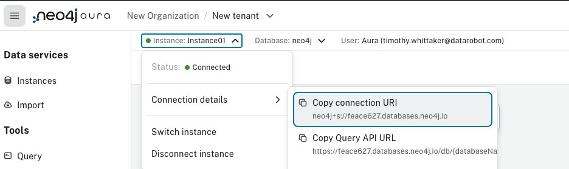

## DataRobot Lineage App

Focused on building dependency graphs for DataRobot Use Cases

Uses react and a node.js backend.  

## Key Dependencies

**Frontend (Client):**
- React 19.0.0 - Core UI framework
- React Bootstrap - UI components and styling
- Vite - Build tool and development server
- vis-network - Network graph visualization
- Axios - HTTP client for API calls

**Backend:**
- Node.js - Server runtime
- Neo4j - Graph database for data lineage

## Usage 

```
npm install
cd ./client && npm install && npm run build
cd ..
npm start
```

## Utilizing chat (in process)

need a running instance of neo4j.  

### Using AuraDB

The easiest path is to create a free [neo4j auradb instance](https://neo4j.com/product/auradb)

You'll need to create login, then create an instance.  

__MAKE SURE TO DOWNLOAD THE PASSWORD__

After the instance is created, you will need the instance URI.   


Add the password and the instance URI to `.env` file as `NEO4J_PASSWORD` and `NEO4J_URL`.  

### Using Docker locally

```
docker run \
    -p 7474:7474 -p 7687:7687 \
    --name neo4j-apoc \
    -e NEO4J_apoc_export_file_enabled=true \
    -e NEO4J_apoc_import_file_enabled=true \
    -e NEO4J_apoc_import_file_use__neo4j__config=true \
    -e NEO4J_PLUGINS=\[\"apoc\"\] \
    neo4j:2025.01
```

every time you start the docker image, you should login to the neo4j UI at localhost:7474.  user and password is neo4j.  You MUST reset the password and update `.env` before using the chat piece of the app

## Troubleshooting

### Build Errors

**"Rollup failed to resolve import 'react-bootstrap'"**

This error occurs when the react-bootstrap dependency is missing. Ensure all dependencies are installed:

```bash
cd client
npm install
npm run build
```

If the error persists, check that `react-bootstrap` and `bootstrap` are listed in `client/package.json` dependencies.

# DataRobot API Configuration
DATAROBOT_ENDPOINT=https://your-datarobot-instance.com/api/v2
DATAROBOT_API_TOKEN=your-api-token-here

# Neo4j Configuration (for chat functionality) 
NEO4J_URL=your-neo4j-url-here
NEO4J_PASSWORD=your-neo4j-password-here

# Server Configuration
PORT=8080
